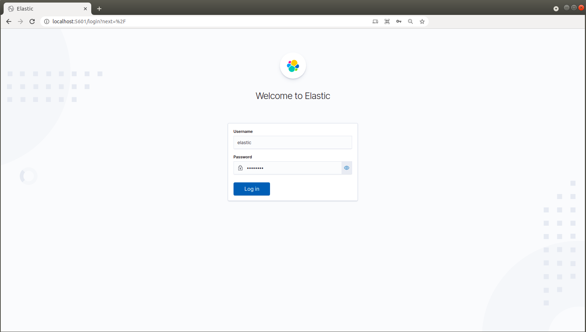

# miniobs

miniobs v7.12.0 contains various elastic stack use cases based on elastiv v7.12.0 for demo or learning purposes.

This is made with Herblut/2021 - please give us a [GitHub Star](https://github.com/prosmc/miniobs/stargazers)
if you like the project. Thank you in advance!

###### ELASTIC STACK RELEASE NOTES
---
Elastic Blog Post: [https://www.elastic.co/blog/whats-new-elastic-7-12-0-schema-on-read-frozen-tier-autoscaling](https://www.elastic.co/blog/whats-new-elastic-7-12-0-schema-on-read-frozen-tier-autoscaling)  

Elastic Stack  
Elasticsearch: [https://www.elastic.co/blog/whats-new-elasticsearch-7-12-0-put-a-search-box-on-s3](https://www.elastic.co/blog/whats-new-elasticsearch-7-12-0-put-a-search-box-on-s3)  
Kibana: [https://www.elastic.co/blog/whats-new-kibana-7-12-0-manage-long-running-searches-in-background](https://www.elastic.co/blog/whats-new-kibana-7-12-0-manage-long-running-searches-in-background)  

Elastic Solutions  
Elastic Search Enterprise: [https://www.elastic.co/blog/whats-new-elastic-enterprise-search-7-12-0-web-crawler-updates-optimized-performance](https://www.elastic.co/blog/whats-new-elastic-enterprise-search-7-12-0-web-crawler-updates-optimized-performance)  
Elastic Observability: [https://www.elastic.co/blog/whats-new-elastic-observability-7-12-0-apm-correlations-opentelemetry-native-support](https://www.elastic.co/blog/whats-new-elastic-observability-7-12-0-apm-correlations-opentelemetry-native-support)  
Elastic Security: [https://www.elastic.co/blog/whats-new-elastic-security-7-12-0-analyst-driven-correlation-ransomware-prevention](https://www.elastic.co/blog/whats-new-elastic-security-7-12-0-analyst-driven-correlation-ransomware-prevention)  

###### PREREQUISITES
---
For running the miniobs-recipes(s) you need the following software components on your host system

Name           | Reference    
-------------- | --------------- 
ubuntu         | >= 18.04.5 LTS (Bionic Beaver)
docker         | [https://docs.docker.com/engine/reference/run/](https://docs.docker.com/engine/reference/run/)
docker-compose | [https://docs.docker.com/compose/reference/overview/](https://docs.docker.com/compose/reference/overview/)

###### REPOSITORY CONTENT
---

Recipe Categories         | Main Focus             | Components
--------------------------|------------------------|-----------------------------------------------------------------------
miniobs-000 - miniobs-100 | Elasticsearch Cluster  | Elasticsearch, Kibana
miniobs-100 - miniobs-200 | Logstash               | Elasticsearch, Kibana, Logstash
miniobs-200 - miniobs-300 | Beats                  | Elasticsearch, Kibana, Logstash, Beats
miniobs-300 - miniobs-400 | APM/Tracing            | Elasticsearch, Kibana, APM, OpsBeans
miniobs-400 - miniobs-500 | Machine Learning       | Elasticsearch, Kibana, Beats, Machine Learning
miniobs-500 - miniobs-600 | Full Stack             | Elasticsearch, Kibana, Logstash, Beats, APM, OpsBean
miniobs-600 - miniobs-700 | Third Party            | i.e. Apache Kafka, Grafana etc ...

###### ELASTICSEARCH CLUSTER: miniobs-000 - miniobs-100 
---

Name         | Components                   | Description
-------------|------------------------------|------------------------------------------------------------------------------------------
miniobs-005  | 1x es/1x kb                  | 1x Node cluster with minimal (starter) config 
miniobs-010  | 1x es/1x kb                  | 1x Node cluster with extended config, basic security and license features
miniobs-015  | 1x es/1x kb                  | 1x Node cluster with extended config, extended security (ssl) and license features
miniobs-020  | 3x es/1x kb                  | 3x Node cluster with extended config, basic security and license features
miniobs-025  | 5x es/1x kb                  | 5x Node cluster with extended config, basic security and license features

###### LOGSTASH: miniobs-100 - miniobs-200
---

Name         | Components                   | Description
-------------|------------------------------|------------------------------------------------------------------------------------------
miniobs-105  | 1x es/1x kb/1x ls            | 1x Node cluster with single Logstash instance
miniobs-110  | 1x es/1x kb/2x ls            | 1x Node cluster with LS => LS => ES composition
miniobs-115  | 1x es/1x kb/2x ls            | 1x Node cluster with LS => ES => LS composition
miniobs-115  | 1x es/1x kb/2x ls            | 1x Node cluster with LS => ES => LS composition and Alerting feature

###### BEATS: miniobs-200 - miniobs-300
---
Name         | Components                   | Description
-------------|------------------------------|------------------------------------------------------------------------------------------
miniobs-205  | 1x es/1x kb/1x ls/1x mb      | 1x Node cluster with a single metricbeat instance
miniobs-210  | 1x es/1x kb/1x ls/1x fb      | 1x Node cluster with a single filebeat instance

###### APM/Tracing: miniobs-300 - miniobs-400
---
Name         | Components                   | Description
-------------|------------------------------|------------------------------------------------------------------------------------------
miniobs-305  | 1x es/1x kb/1x apm/1x nodejs | 1x Node cluster with a single apm instance, opbeans nodejs and opbeans rum

###### FULL STACK: miniobs-500 - miniobs-600
---
Name         | Components                   | Description
-------------|------------------------------|------------------------------------------------------------------------------------------
miniobs-510  | Full Stack Basic             | With SSL

###### THIRD PARTY: miniobs-600 - miniobs-700
---
Name         | Components                   | Description
-------------|------------------------------|------------------------------------------------------------------------------------------
miniobs-605  | 1x es/1x kb/1x kl            | 1x Node cluster with Alerting feature and Korrelator service

SETUP
---

1. Clone the miniobs repo

        $ cd ~
        $ mkdir miniobs-ws01
        $ cd miniobs-ws01
        $ git clone https://github.com/prosmc/miniobs.git

2. Setup your environment

        $ cd miniobs
        $ source ./.xrc
        $ x_setup

    **NOTE:** x_setup modifies Kernel parameter and reboots your host system after 30 seconds\
    due to the modifications of the kernel parameter.
      
3. Choose one of the miniobs use cases (i.e. miniobs-005) and take a look at the specific README\
   for each project for further information.

        $ cd ~/miniobs/miniobs-010
        $ docker-compose up

   **NOTE:** For some recipes it is not sufficent to run the 'docker-compose' command. As mentioned\
   above take a look at the README of each recipe.

4. Use Kibana for further actions

        http://localhost:5601

        user: elastic
        password: changeme

   

5. Stop the docker containers

        $ docker-compose stop

6. Start the docker containers

        $ docker-compose start  

5. Remove the docker containers

        $ docker-compose down -v

CONTRIBUTING
---
If you find some bugs or have any requests/suggestions don't hesitate to open an issue or make a pull request.
