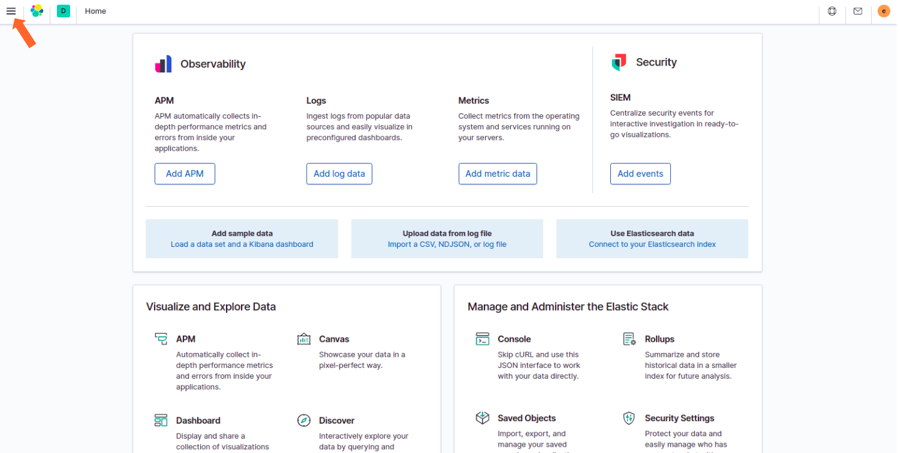
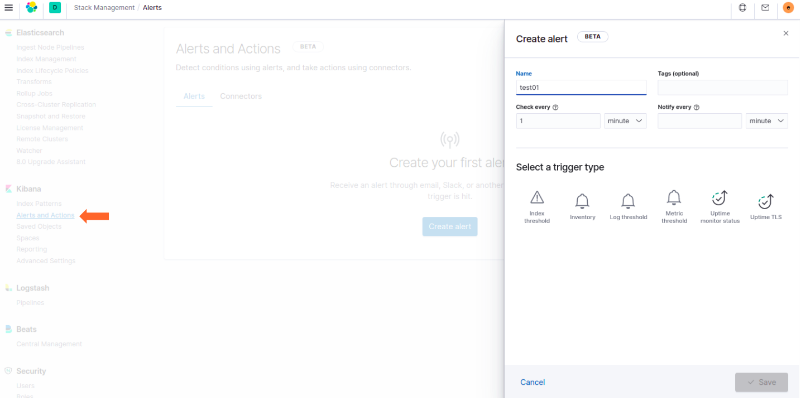

# miniobs-115 - Alerting Feature

The recipe is for testing the new 'Alerting' feature which is shipped with the new elastic stack 'v7.8.x'\
The following description helps you to get up and running without any effort.

This is made with Herblut/2020 - so please give us a [GitHub Star](https://github.com/prosmc/miniobs/stargazers)
if you like the project.\ Thank you in advance!

SETUP
---

01. Clone the miniobs repo ( => if it's already done - skip this point!)

        $ cd ~
        $ mkdir miniobs-ws01
        $ cd miniobs-ws01
        $ git clone https://github.com/prosmc/miniobs.git

02. Initial setup of your environment ( => if it's already done - skip this point!)

        $ cd miniobs
        $ source ./.envrc
        $ x_setup

    **NOTE:** x_setup modifies Kernel parameter and reboots your host system after 30 seconds\
    due to the modifications of the kernel parameter.
      
03. a) Choose the use cases miniobs-115 and generate the ssl-certificate which is needed for running\
   Kibana in a secure mode so that the 'Alerting' can be enabled.

        $ cd ~/miniobs/miniobs-115
        $ docker-compose -f create-certs.yml run --rm create_certs

    b) After the ssl-cert & ssl-key is generated you can start the elastic stack

        $ docker-compose up -d 

    **NOTE:** instead of running the commands in 3 a & 3 b step-by-step you can source the .envrc 
    file for running the function x_inst

        $ . ./.envrc
        $ x_inst

04. Log in to Kibana

        https://<hostname>:5601

        user: elastic
        password: changeme

   

05. Select the Drop-Down Menue
   
   

06. Choose the item "Stack Management"
   
   

07. Click on the item "Alerts and Actions" in the Kibana section
   
   

   Create your first alert.

Stop and Start the elastic stack
---

08. Stop the docker containers

        $ docker-compose stop

09. Start the docker containers

        $ docker-compose start 

Remove the entire stack
---

10. Remove the docker containers

        $ docker-compose down -v

    **NOTE:** when you run 'docker-compose down -v' you'll loose all your data too.

CONTRIBUTING
---
If you find some bugs or have any requests/suggestions don't hesitate to open an issue or make a pull request.
