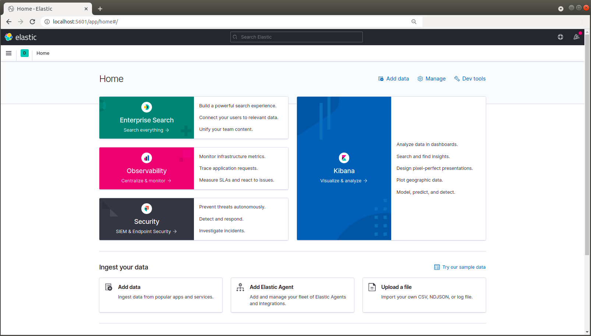

# stack-005 / Basic Architecture

This recipe contains a very simple stack consisting of 1x elasticsearch and 1x kibana node. It's main purpose is to
to get up and running without any effort and as quick as possible.

This is made with Herblut/2021 - please give us a [GitHub Star](https://github.com/schneidermatix/elastic-stax/stargazers)
if you like the project. Thank you in advance!

###### PREREQUISITES
---
For running the stack-recipes(s) you need the following software components on your host system

Name           | Reference    
-------------- | --------------- 
ubuntu         | >= 18.04.5 LTS (Bionic Beaver)
docker         | [https://docs.docker.com/engine/reference/run/](https://docs.docker.com/engine/reference/run/)
docker-compose | [https://docs.docker.com/compose/reference/overview/](https://docs.docker.com/compose/reference/overview/)

SETUP
---

01. Clone the stack repo ( => if it's already done - skip this point!)

        $ cd ~
        $ mkdir workspace
        $ cd workspace
        $ git clone https://github.com/schneidermatix/elastic-stax.git

02. Initial setup of your environment ( => if it's already done - skip this point!)

        $ cd elastic-stax
        $ source ./.xrc
        $ x_setup

    **NOTE:** x_setup modifies Kernel parameter and reboots your host system after 30 seconds\
    due to the modifications of the kernel parameter.
      
03. a) Go to the stack-005 folder

        $ cd ./stack-005

    b) Run the docker-compose command for starting the containers

        $ docker-compose up -d

    **NOTE:** The '.xrc' file contains some short-hand functions for an easier handling. So you\
    can run the 'x_up' command for starting the containers.

        $ . ./.xrc
        $ x_up

    A list of all 'x_*' short-hand commands you can get by running ...

        $ x_ls

04. Use Kibana

        http://localhost:5601

   

05. Use the Elasticsearch REST-API via curl

       $ curl -XGET https://localhost:9200

Stop and Start the elastic stack
---

05. Stop the docker containers

        $ docker-compose stop

06. Start the docker containers

        $ docker-compose start 

Remove the entire stack
---

07. Remove the docker containers

        $ docker-compose down -v

    **NOTE:** when you run 'docker-compose down -v' you'll loose all your data too.

CONTRIBUTING
---
If you find some bugs or have any requests/suggestions don't hesitate to open an issue or make a pull request.
